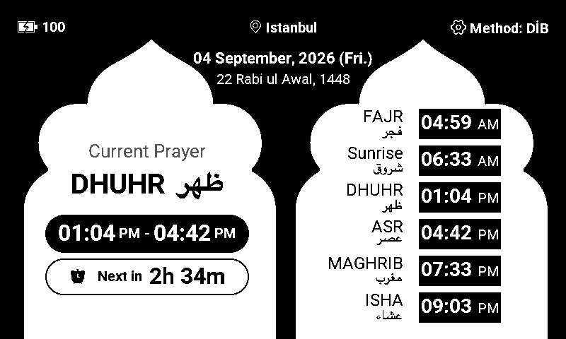
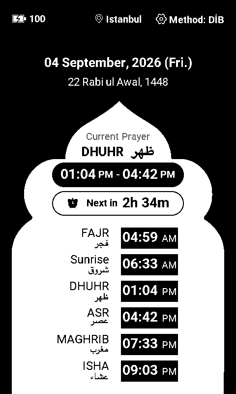
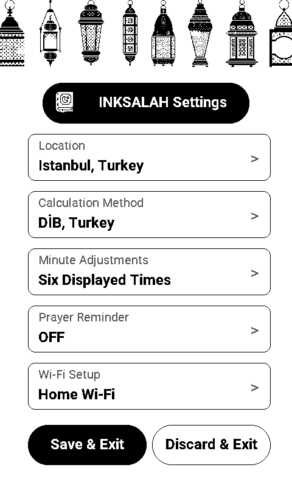
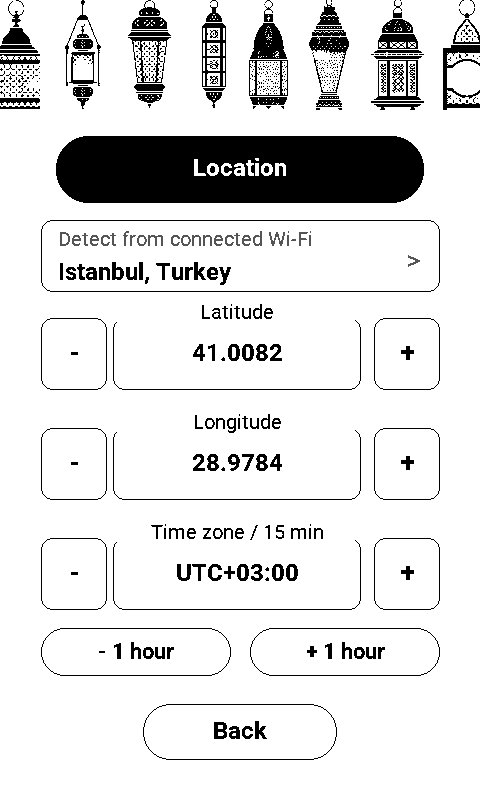

# InkSalah

InkSalah turns reTerminal Sticky into an offline-first Salah companion with a
persistent ePaper prayer-window display and native touch settings.

## Version 0.1.1

- Roboto typography, connected Arabic labels, and explicit AM/PM time badges.
- Independent portrait and landscape arch layouts for the current prayer and
  daily schedule.
- Aligned status-bar icons and text, with larger settings and location touch
  targets. Tap the city or location icon to open Location directly.
- Continuous rounded edges on prayer-time capsules, countdowns, and buttons.
- The prayer display and sleep crescent remain visible when an orientation
  wake settles in the same direction.

See the [upstream changelog](https://github.com/limengdu/reTerminal_Sticky_InkSalah/blob/main/CHANGELOG.md)
for the complete release notes.

## Interface



<table>
  <tr>
    <td align="center"></td>
    <td align="center"></td>
    <td align="center"></td>
  </tr>
  <tr>
    <td align="center">Prayer window</td>
    <td align="center">On-device settings</td>
    <td align="center">Location</td>
  </tr>
</table>

These interface images come from the version 0.1.1 native renderer with a fixed
Istanbul demonstration scenario. The catalog's [real-device photo](assets/preview.jpg)
records the version 0.1.0 hardware test.

## What it does

- **Prayer windows.** Shows the active prayer window, its end, remaining time,
  and the next obligatory prayer.
- **Local calculation.** Calculates Fajr, Sunrise, Dhuhr, Asr, Maghrib, Isha,
  and optional Qiyam on the ESP32-S3 without downloading prayer timetables.
- **Prayer configuration.** Provides recognized calculation profiles, Standard
  and Hanafi Asr rules, per-time minute adjustments, an optional reminder, and
  optional Qiyam display.
- **Native interaction.** Uses the Sticky touchscreen for settings, the IMU for
  portrait and landscape layouts, and RTC scheduling for low-power operation.
- **Private setup.** Stores Wi-Fi credentials and prayer settings locally in
  ESP32 NVS storage.

## Requirements

- reTerminal Sticky
- USB-C data cable for browser installation
- A 2.4 GHz Wi-Fi network for first-time clock synchronization and optional
  approximate location detection
- A phone or computer for the first-time captive Wi-Fi page

Prayer times are calculated locally from the saved coordinates, civil date,
fixed UTC offset, calculation method, and Asr school. Wi-Fi is not used to
download a prayer timetable.

## Firmware package

- Latest Registry firmware version: `0.1.1` (beta)
- Previous available version: `0.1.0`
- Source: <https://github.com/limengdu/reTerminal_Sticky_InkSalah>
- Source commit: `0e2bfb2c0eeb591a9d282987cea468a836048acd`
- License: MIT
- Build environment: `sticky-salah-release`
- Platform: Espressif32 `6.11.0`
- Framework: ESP-IDF `5.4.1`
- Target: ESP32-S3 with 32 MB flash

The package contains the local PlatformIO release build's bootloader, partition
table, and application at offsets `0x0000`, `0x8000`, and `0x10000`. The release
build was verified against the clean source commit above. Every packaged file
is byte-identical to its local build output. The manifest records the file
sizes and SHA-256 values used by the browser installer.

GitHub Actions [run 34194710069](https://github.com/limengdu/reTerminal_Sticky_InkSalah/actions/runs/34194710069)
independently passed all 30 host tests and both release and debug builds for
the same source commit. The Registry package uses the local build; the CI
artifact is a separate build.

Application SHA-256:

```text
02accc5d45ea94ec8f23ba4206d55554c023bc098c8f1ef72fd7e159728796ad
```

## Installation and first boot

1. Open InkSalah from the reTerminal Sticky Playground in desktop Chrome or
   Edge.
2. Connect the device with a USB-C data cable and select its serial port.
3. Start the installation and accept the erase prompt for a clean first boot.
4. Connect a phone to the `Sticky-Salah-XXXX` setup network using the password
   `sticky-salah`.
5. Select a scanned 2.4 GHz Wi-Fi network or type a hidden SSID, then choose
   **Check and save**.
6. On the Sticky screen, confirm the detected location and UTC offset, select a
   calculation method and Asr school, and choose **Save & Start**.

The network-based location is an estimate. Confirm its coordinates and UTC
offset before saving. For congregational prayer and local religious guidance,
follow the timetable and iqamah schedule published by a trusted local mosque or
authority.

## Daily controls

- Swipe up from the bottom of the prayer screen to open settings.
- Tap the gear to open settings, or tap the location icon or city name to open
  Location directly.
- Swipe down from the top of settings to validate, save, and return.
- Swipe right from the left edge inside a settings subpage to return one level
  while keeping the draft.
- Rotate the device to switch between portrait and landscape layouts.
- Leave the device untouched for three minutes to enter deep sleep.

Settings provides **Location**, **Calculation Method**, **Minute Adjustments**,
**Prayer Reminder**, and **Wi-Fi Setup**. **Minute Adjustments → Show Qiyam**
controls the optional seventh time. **Back** keeps the settings draft when
returning one level; **Save & Exit** applies it and **Discard & Exit** restores
the saved configuration. **Back** from Wi-Fi setup returns with the saved
network, without restarting the device.

## Verification

### Version 0.1.1 package

| Check | Result |
| --- | --- |
| Local `sticky-salah-release` build | Passed |
| Source CI host tests | Passed, 30/30 |
| Source CI release and debug builds | Passed |
| Packaged files compared with local build outputs | Byte-identical |
| Application image inspection | ESP32-S3, 32 MB, version `0.1.1`, checksum and validation hash valid |
| Version 0.1.0 package and real-device photo | Preserved unchanged |
| Physical installation of the exact version 0.1.1 package | Pending |

For hardware acceptance, install version 0.1.1 using its manifest, confirm the
boot log reports `firmware=0.1.1`, then check:

1. First boot, Wi-Fi onboarding, and saved settings after a power cycle.
2. Portrait and landscape prayer screens, Arabic labels, AM/PM times, and
   Qiyam enabled and disabled.
3. Gear and location shortcuts, settings gestures, coordinate entry, and
   return from Wi-Fi setup.
4. Three-minute idle sleep, touch and rotation wake, and movement that settles
   in the original orientation while preserving the prayer display.
5. USB reconnection and repeated installation of the same package.

### Version 0.1.0 physical-device record

The exact three files in `firmware/0.1.0/` were built from source commit
`e59cec9e63d4cc9a4a6a33f1909b02e0f2a88e16` and written to reTerminal Sticky
production hardware at the manifest offsets with esptool. Each write completed
with its data hash verified. A cold restart then reported InkSalah `0.1.0`,
connected to Wi-Fi, synchronized the RTC, restored the saved Shenzhen settings,
rendered the prayer page, and started touch and IMU monitoring. The submitted
preview is a real-device photo of the portrait prayer-window interface.

| Item | Result |
| --- | --- |
| Hardware | reTerminal Sticky production hardware |
| Firmware version | `0.1.0` |
| Exact Registry package write and hash verification | Passed |
| Wi-Fi setup and clock synchronization | Passed |
| Local prayer calculation and seven-time timeline | Passed |
| Native touch settings and saved configuration | Passed |
| Portrait and landscape rotation | Passed |
| Three-minute idle sleep and wake paths | Passed |
| Reboot with saved settings restored | Passed |
| USB reconnection and repeated installation | Passed |

## Links

- [Project source and documentation](https://github.com/limengdu/reTerminal_Sticky_InkSalah)
- [Prayer calculation reference](https://github.com/limengdu/reTerminal_Sticky_InkSalah/blob/main/docs/PRAYER_CALCULATION.md)
- [Sticky official website](https://www.seeedstudio.com/sticky/)
- [reTerminal Sticky product page](https://www.seeedstudio.com/reTerminal-Sticky-p-6861.html)
- [Project support](https://github.com/limengdu/reTerminal_Sticky_InkSalah/issues)
